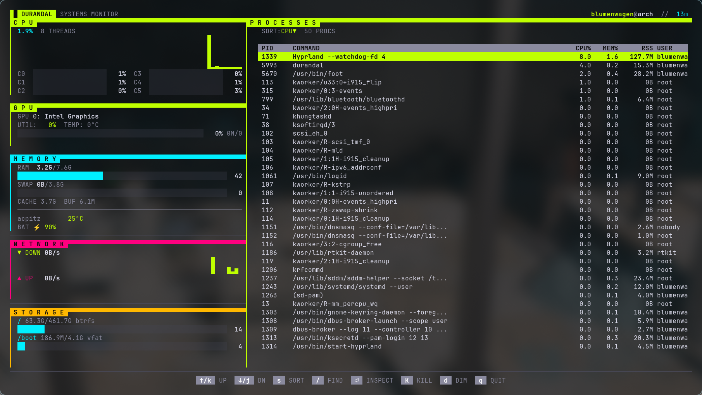

# Durandal



Durandal is a modern system monitor for Linux written in Go. It is designed to be pretty and easy to use.

Durandal is designed to be pretty and minimal. It is written in Go and uses Bubbletea for the UI. I tried to make a system monitor that is inspired by the design of the new Marathon games style, which is why it is called Durandal. I wouldn't say I achieved that, but I had fun trying.

As I am trying to get into learning Go. Durandal is, much like synx, also a learning project for me so I have made use of llms in its creation.

## Lapis Sentinel

Durandal now includes a small `LAPIS SENTINEL` panel: an opinionated ops-readiness triage strip that turns the current CPU, RAM, swap, disk, network, and hot-process state into a compact score plus the most urgent signals. It is meant to make the monitor more useful at a glance on a VPS: if something is close to hurting the host, the panel should say so before the individual gauges need to be interpreted.

## Docker Control Station

Durandal also includes a `DOCKER` station beneath the process list. It uses the local Docker CLI to show `docker ps -a`, with running containers listed first. Press `c` to focus the station, move with `j/k` or arrow keys, press `x` to start or stop the selected container, and press `r` to restart a running container. Destructive actions ask for `y/n` confirmation.

Run from source with:

```bash
go run .
```

Build/install locally with:

```bash
go build -o durandal .
```
